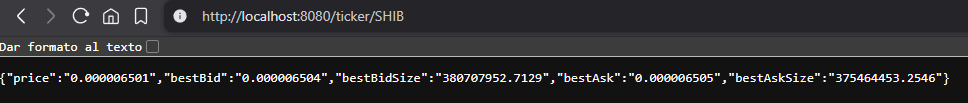

# Hexagonal architecture + Microservice + DDD + Spring-boot + Java 17

This is an example to show how you can connect a **microservice** to the API of an exchange such as Kucoin to obtain all the information from a cryptocurrency ticker. 

## How does it work?

Once our **microservice** is deployed and up and running, an endpoint (http://localhost:8080/ticker/{symbol}) will be created where we can enter the symbol of our cryptocurrency.

The **microservice** will be responsible for connecting to Kucoin's public API to obtain the information.

Our **microservice** is composed of the layers used in a project built with `hexagonal architecture` (infrastructure, application, and domain).

For the example, you can use any of the symbols available on Kucoin (BTC, ETH, DOT, SHIB, ADA, AVAX, etc.).

## Screenshot



## How to run it?

```
mvn spring-boot:run

```

## How can I test it?

You have one endpoint:

Get - http://localhost:8080/ticker/{symbol}

And that's all!

Developed by Luis L.T.
